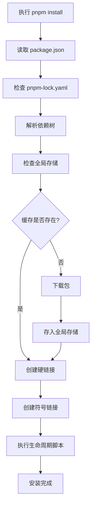

# pnpm 安装依赖包机制以及依赖包管理机制

本文深入剖析 pnpm 的工作原理，包括其独特的依赖管理策略、安装机制、存储结构以及相比 npm/yarn 的优势。

## 目录

- [一、pnpm 简介与核心优势](#一pnpm-简介与核心优势)
- [二、pnpm 的核心概念](#二pnpm-的核心概念)
- [三、依赖管理机制详解](#三依赖管理机制详解)
- [四、安装流程详解](#四安装流程详解)
- [五、pnpm 的目录结构](#五pnpm-的目录结构)
- [六、与 npm/yarn 的对比](#六与-npmyarn-的对比)
- [七、Monorepo 支持](#七monorepo-支持)
- [八、性能优化与最佳实践](#八性能优化与最佳实践)
- [九、常见问题与解决方案](#九常见问题与解决方案)
- [十、限制项目只能使用 pnpm](#十限制项目只能使用-pnpm)
- [十一、迁移指南](#十一迁移指南)

---

## 一、pnpm 简介与核心优势

### 什么是 pnpm？

**pnpm**（performant npm）是一个快速、节省磁盘空间的包管理器，于 2017 年发布。它通过独特的依赖管理方式，解决了 npm 和 yarn 的一些痛点。

### 核心优势

#### 1. 💾 极致的磁盘空间节省

```
传统 npm/yarn：
project1/node_modules/lodash  ← 100MB
project2/node_modules/lodash  ← 100MB (重复)
project3/node_modules/lodash  ← 100MB (重复)
总计：300MB

pnpm：
.pnpm-store/lodash            ← 100MB (只存一份)
project1/node_modules/lodash  → 硬链接
project2/node_modules/lodash  → 硬链接
project3/node_modules/lodash  → 硬链接
总计：100MB (节省 66%)
```

#### 2. ⚡ 更快的安装速度

| 操作        | npm | yarn | pnpm     |
| ----------- | --- | ---- | -------- |
| 首次安装    | 51s | 35s  | **23s**  |
| 有缓存      | 24s | 16s  | **1.5s** |
| 有 lockfile | 18s | 12s  | **1.3s** |

> 数据来源：pnpm benchmark（具体数值因项目而异）

#### 3. 🔒 严格的依赖管理

- ✅ 解决"幽灵依赖"（phantom dependencies）问题
- ✅ 只能访问 package.json 中声明的依赖
- ✅ 避免依赖提升导致的不确定性

#### 4. 🏢 原生 Monorepo 支持

- 内置 workspace 功能
- 高效的多包管理
- 共享依赖，避免重复安装

---

## 二、pnpm 的核心概念

### 1. 内容寻址存储（Content-Addressable Store）

pnpm 使用全局存储目录来保存所有包的内容：

```bash
# 全局存储位置
~/.pnpm-store/v3/files/

# 结构示例
.pnpm-store/
  v3/
    files/
      00/ ← 按文件内容 hash 的前两位分目录
        1a2b3c4d5e... ← 实际文件内容
      01/
      ...
```

**特点：**

- 每个文件只存储一次（基于内容 hash）
- 相同的包版本在所有项目间共享
- 包的不同版本只存储差异部分

### 2. 硬链接（Hard Links）

硬链接是文件系统级别的链接，指向相同的 inode（文件数据）。

```
存储中的文件 ←─ 硬链接 ─→ node_modules 中的文件
    (inode)                  (同一个 inode)
```

**优势：**

- 不占用额外磁盘空间
- 修改任一处，另一处同步更新
- 操作系统级别的支持，性能极佳

### 3. 符号链接（Symbolic Links）

符号链接用于组织 node_modules 的结构。

```
node_modules/
  .pnpm/
    lodash@4.17.21/  ← 实际内容（硬链接到全局存储）
  lodash/            ← 符号链接指向 .pnpm/lodash@4.17.21/
```

### 4. 非平铺的 node_modules 结构

pnpm 不使用扁平化结构，而是使用嵌套 + 符号链接的方式：

```
node_modules/
├── .pnpm/                          # pnpm 的虚拟存储
│   ├── lodash@4.17.21/
│   │   └── node_modules/
│   │       └── lodash/             # 硬链接到全局存储
│   ├── express@4.18.0/
│   │   └── node_modules/
│   │       ├── express/            # 硬链接到全局存储
│   │       ├── body-parser/        # 符号链接
│   │       └── ...
│   └── ...
├── lodash -> .pnpm/lodash@4.17.21/node_modules/lodash
└── express -> .pnpm/express@4.18.0/node_modules/express
```

---

## 三、依赖管理机制详解

### 1. 依赖解析策略

#### 直接依赖（Direct Dependencies）

package.json 中声明的依赖会在 node_modules 根目录创建符号链接：

```json
// package.json
{
  "dependencies": {
    "express": "^4.18.0"
  }
}
```

```
node_modules/
  express -> .pnpm/express@4.18.0/node_modules/express  ✅ 可访问
```

#### 间接依赖（Indirect Dependencies）

未在 package.json 中声明的依赖不会在根目录创建链接：

```javascript
// ❌ 这样会报错（即使 express 依赖了 body-parser）
import bodyParser from "body-parser";
// Error: Cannot find module 'body-parser'

// ✅ 必须显式声明
// package.json 添加: "body-parser": "^1.20.0"
```

**这解决了"幽灵依赖"问题！**

### 2. 依赖去重机制

pnpm 通过内容寻址实现极致的去重：

#### 场景 1：相同版本的包

```
项目 A 依赖 lodash@4.17.21
项目 B 依赖 lodash@4.17.21
项目 C 依赖 lodash@4.17.21

结果：全局存储中只有一份 lodash@4.17.21
     所有项目通过硬链接共享
```

#### 场景 2：不同版本的包

```
项目 A 依赖 lodash@4.17.21
项目 B 依赖 lodash@4.17.20

结果：全局存储中有两个版本
     但文件级别仍然去重（只存储差异）
```

#### 场景 3：文件级去重

```
lodash@4.17.21 和 lodash@4.17.20 中：
- 95% 的文件相同 → 只存储一份
- 5% 的文件不同 → 分别存储

总存储 ≈ 1.05 份，而不是 2 份！
```

### 3. Peer Dependencies 处理

pnpm 对 peerDependencies 的处理更加严格：

```json
// package.json
{
  "dependencies": {
    "react-router": "^6.0.0"
  }
}

// react-router 的 package.json
{
  "peerDependencies": {
    "react": ">=16.8.0"
  }
}
```

**pnpm 的行为：**

- ⚠️ 如果未安装 react，会发出警告
- 📦 可以配置 `auto-install-peers=true` 自动安装
- 🔍 会检查版本是否满足要求

### 4. 依赖提升（Hoisting）

pnpm 默认不提升依赖，但提供了配置选项：

```yaml
# .npmrc
hoist=true                    # 启用提升
hoist-pattern[]=*eslint*     # 只提升特定包
public-hoist-pattern[]=*types*  # 提升到根目录
```

**为什么默认不提升？**

- ✅ 避免幽灵依赖
- ✅ 确保依赖的可预测性
- ✅ 防止版本冲突

---

## 四、安装流程详解

### 完整安装流程



### 详细步骤分析

#### 1. 依赖解析阶段

```bash
pnpm install express
```

**步骤：**

1. 读取 `package.json` 和 `pnpm-lock.yaml`
2. 解析 express 的版本范围
3. 递归获取所有依赖（dependencies + peerDependencies）
4. 构建依赖图（dependency graph）
5. 解决依赖冲突

#### 2. 完整性检查

```bash
# 检查全局存储
~/.pnpm-store/v3/files/
  ├── 检查 express@4.18.0 是否存在
  ├── 验证文件完整性（hash）
  └── 确定需要下载的文件列表
```

#### 3. 下载与存储

**如果缓存不存在：**

```bash
1. 从 npm registry 下载 tarball
2. 解压 tarball
3. 计算每个文件的 hash
4. 将文件存入全局存储：
   ~/.pnpm-store/v3/files/[hash前2位]/[完整hash]
```

**如果缓存存在：**

```bash
跳过下载，直接进入链接阶段
```

#### 4. 创建硬链接

```bash
# 从全局存储创建硬链接到虚拟存储
全局存储: ~/.pnpm-store/v3/files/ab/cd1234...
                    ↓ 硬链接
虚拟存储: node_modules/.pnpm/express@4.18.0/node_modules/express/index.js
```

#### 5. 创建符号链接

```bash
# 创建符号链接到项目根目录
node_modules/express -> .pnpm/express@4.18.0/node_modules/express
```

#### 6. 执行脚本

```bash
# 按顺序执行生命周期脚本
1. preinstall
2. install
3. postinstall
4. prepare (仅在根项目)
```

### 安装模式对比

| 模式     | 命令                             | 行为                 |
| -------- | -------------------------------- | -------------------- |
| 标准安装 | `pnpm install`                   | 安装所有依赖         |
| 生产安装 | `pnpm install --prod`            | 只安装 dependencies  |
| 冻结安装 | `pnpm install --frozen-lockfile` | 严格按 lockfile 安装 |
| 离线安装 | `pnpm install --offline`         | 只使用缓存           |
| 优先离线 | `pnpm install --prefer-offline`  | 优先使用缓存         |

---

## 五、pnpm 的目录结构

### 1. 项目目录结构

```
my-project/
├── node_modules/
│   ├── .pnpm/                          # 虚拟存储目录
│   │   ├── .modules.yaml               # 模块信息
│   │   ├── express@4.18.0/
│   │   │   └── node_modules/
│   │   │       ├── express/            # 硬链接到全局存储
│   │   │       ├── accepts -> ../../accepts@1.3.8/node_modules/accepts
│   │   │       ├── body-parser -> ../../body-parser@1.20.0/node_modules/body-parser
│   │   │       └── ...                 # 其他依赖（符号链接）
│   │   ├── lodash@4.17.21/
│   │   │   └── node_modules/
│   │   │       └── lodash/             # 硬链接到全局存储
│   │   └── ...
│   ├── .modules.yaml                   # pnpm 元数据
│   ├── express -> .pnpm/express@4.18.0/node_modules/express
│   └── lodash -> .pnpm/lodash@4.17.21/node_modules/lodash
├── package.json
├── pnpm-lock.yaml                      # 锁文件
└── .npmrc                              # pnpm 配置
```

### 2. 虚拟存储（.pnpm）

`.pnpm` 目录是 pnpm 的核心，包含所有依赖的实际内容：

```
.pnpm/
├── <package-name>@<version>/
│   └── node_modules/
│       ├── <package-name>/             # 包本身（硬链接）
│       └── <dependency>/               # 依赖（符号链接）
└── ...
```

**命名规则：**

```
简单包: lodash@4.17.21
带 scope: @vue/reactivity@3.2.0
带 peer: react-dom@18.0.0_react@18.0.0
```

### 3. 全局存储目录

```bash
# 查看全局存储位置
pnpm store path
# 输出: /Users/username/Library/pnpm/store/v3

# 目录结构
~/.pnpm-store/
└── v3/
    ├── files/                          # 实际文件存储
    │   ├── 00/
    │   │   ├── 1a2b3c...               # 文件内容
    │   │   └── ...
    │   ├── 01/
    │   └── ...
    └── tmp/                            # 临时文件
```

### 4. 关键文件说明

#### pnpm-lock.yaml

```yaml
lockfileVersion: 5.4

specifiers:
  express: ^4.18.0

dependencies:
  express: 4.18.2

packages:
  /express/4.18.2:
    resolution: { integrity: sha512-xxx... }
    dependencies:
      accepts: 1.3.8
      body-parser: 1.20.1
    dev: false
```

**特点：**

- 📝 人类可读的 YAML 格式
- 🔒 记录完整的依赖图
- ✅ 包含完整性校验信息

#### .npmrc 配置

```ini
# 全局存储位置
store-dir=~/.pnpm-store

# 自动安装 peer dependencies
auto-install-peers=true

# 严格的 peer dependencies
strict-peer-dependencies=true

# 不提升依赖
hoist=false

# 使用国内镜像
registry=https://registry.npmmirror.com/
```

---

## 六、与 npm/yarn 的对比

### 1. 目录结构对比

#### npm/yarn（扁平化）

```
node_modules/
├── express/              # 直接依赖
├── body-parser/          # express 的依赖（提升）
├── accepts/              # express 的依赖（提升）
├── lodash/               # 直接依赖
└── ...                   # 所有包都在同一层级

问题：
❌ 可以访问未声明的依赖（幽灵依赖）
❌ 依赖版本冲突时结构不确定
❌ 重复安装（不同项目间）
```

#### pnpm（符号链接 + 硬链接）

```
node_modules/
├── .pnpm/                # 虚拟存储
│   ├── express@4.18.0/
│   ├── body-parser@1.20.0/
│   └── ...
├── express -> .pnpm/...  # 符号链接
└── lodash -> .pnpm/...   # 符号链接

优势：
✅ 只能访问声明的依赖
✅ 结构确定且可预测
✅ 跨项目共享（硬链接）
```

### 2. 磁盘空间对比

**实际测试（典型 React 项目）：**

| 包管理器 | 磁盘占用 | 节省比例 |
| -------- | -------- | -------- |
| npm      | 350 MB   | -        |
| yarn     | 340 MB   | 3%       |
| pnpm     | 120 MB   | **66%**  |

**多项目场景（3 个类似项目）：**

| 包管理器 | 总磁盘占用 | 平均每项目 |
| -------- | ---------- | ---------- |
| npm      | 1050 MB    | 350 MB     |
| yarn     | 1020 MB    | 340 MB     |
| pnpm     | 130 MB     | **43 MB**  |

### 3. 安装速度对比

**冷安装（无缓存）：**

```
npm:  ████████████████████ 20s
yarn: ███████████████ 15s
pnpm: ██████████ 10s
```

**热安装（有缓存）：**

```
npm:  ████████ 8s
yarn: ████ 4s
pnpm: █ 1s  ← 惊人的快！
```

**原因分析：**

- ✅ pnpm 只需创建硬链接（几乎瞬间）
- ❌ npm/yarn 需要复制大量文件

### 4. 功能对比

| 功能         | npm     | yarn  | pnpm    |
| ------------ | ------- | ----- | ------- |
| 磁盘空间效率 | ❌      | ❌    | ✅ 极佳 |
| 安装速度     | ⚠️ 中   | ✅ 快 | ✅ 最快 |
| 严格依赖     | ❌      | ❌    | ✅      |
| Monorepo     | ⚠️ 基础 | ✅ 好 | ✅ 优秀 |
| 缓存机制     | ✅      | ✅    | ✅      |
| 离线安装     | ✅      | ✅    | ✅      |
| 插件系统     | ❌      | ✅    | ✅      |
| 安全性       | ✅      | ✅    | ✅      |

---

## 七、Monorepo 支持

### 1. Workspace 配置

#### 项目结构

```
my-monorepo/
├── pnpm-workspace.yaml     # workspace 配置
├── package.json            # 根 package.json
├── packages/
│   ├── pkg-a/
│   │   └── package.json
│   ├── pkg-b/
│   │   └── package.json
│   └── shared/
│       └── package.json
└── node_modules/
```

#### pnpm-workspace.yaml

```yaml
packages:
  # 包含 packages 目录下的所有包
  - "packages/*"
  # 包含 apps 目录下的所有包
  - "apps/*"
  # 排除测试目录
  - "!**/test/**"
```

### 2. 依赖管理

#### 内部包引用

```json
// packages/pkg-a/package.json
{
  "name": "@myorg/pkg-a",
  "dependencies": {
    "@myorg/shared": "workspace:*" // 使用 workspace 协议
  }
}
```

**workspace 协议：**

```
workspace:*       # 任何版本
workspace:^1.0.0  # 版本范围
workspace:~       # 使用当前版本
```

#### 依赖提升策略

```yaml
# .npmrc
shared-workspace-lockfile=true    # 共享 lockfile
link-workspace-packages=true      # 链接 workspace 包
prefer-workspace-packages=true    # 优先使用 workspace 包
```

### 3. 常用命令

```bash
# 为所有包安装依赖
pnpm install

# 为特定包添加依赖
pnpm add lodash --filter @myorg/pkg-a

# 为所有包添加依赖
pnpm add -w lodash

# 运行特定包的脚本
pnpm --filter @myorg/pkg-a run build

# 运行所有包的脚本
pnpm -r run build

# 并行运行（更快）
pnpm -r --parallel run build

# 按依赖顺序运行
pnpm -r --workspace-concurrency=1 run build
```

### 4. 过滤器（Filter）

pnpm 提供强大的过滤功能：

```bash
# 按包名过滤
pnpm --filter "@myorg/pkg-a" run test

# 按路径过滤
pnpm --filter "./packages/pkg-a" run test

# 过滤受影响的包（自上次 commit）
pnpm --filter "...[origin/main]" run test

# 过滤依赖某个包的包
pnpm --filter "...@myorg/shared" run build

# 排除特定包
pnpm --filter "!@myorg/pkg-a" run test

# 组合过滤
pnpm --filter "@myorg/*" --filter "!@myorg/pkg-a" run build
```

---

## 八、性能优化与最佳实践

### 1. 配置优化

#### .npmrc 推荐配置

```ini
# ========== 性能优化 ==========

# 使用全局存储（默认）
store-dir=~/.pnpm-store

# 启用侧效应缓存（提升重复安装速度）
side-effects-cache=true

# 并行安装数量（根据 CPU 核心数调整）
network-concurrency=16

# 使用更快的锁文件格式
lockfile-version=5.4


# ========== 依赖管理 ==========

# 严格的 peer dependencies（推荐）
strict-peer-dependencies=true

# 自动安装 peer dependencies
auto-install-peers=true

# 不提升依赖（避免幽灵依赖）
hoist=false

# 仅提升类型定义（提升开发体验）
public-hoist-pattern[]=*types*
public-hoist-pattern[]=*eslint*


# ========== 国内加速 ==========

# 使用国内镜像
registry=https://registry.npmmirror.com/

# Electron 镜像
electron-mirror=https://npmmirror.com/mirrors/electron/

# Node.js 镜像
node-mirror=https://npmmirror.com/mirrors/node/


# ========== 其他配置 ==========

# 保存精确版本
save-exact=false

# 忽略 scripts（安全考虑）
ignore-scripts=false

# 使用符号链接（Windows）
symlink=true
```

### 2. CI/CD 优化

#### GitHub Actions 示例

```yaml
name: CI

on: [push, pull_request]

jobs:
  test:
    runs-on: ubuntu-latest
    steps:
      - uses: actions/checkout@v3

      - uses: pnpm/action-setup@v2
        with:
          version: 8

      - uses: actions/setup-node@v3
        with:
          node-version: 18
          cache: "pnpm" # 🚀 关键：启用缓存

      - name: Install dependencies
        run: pnpm install --frozen-lockfile # 使用精确版本

      - name: Run tests
        run: pnpm test
```

#### Docker 优化

```dockerfile
FROM node:18-alpine

# 安装 pnpm
RUN corepack enable && corepack prepare pnpm@latest --activate

WORKDIR /app

# 分层缓存：先安装依赖
COPY pnpm-lock.yaml package.json ./
RUN pnpm install --frozen-lockfile

# 再复制源代码
COPY . .

RUN pnpm build

CMD ["pnpm", "start"]
```

**优化技巧：**

```dockerfile
# 使用 fetch 命令预下载依赖（利用 Docker 缓存）
COPY pnpm-lock.yaml ./
RUN pnpm fetch

# 再完整安装
COPY package.json ./
RUN pnpm install --offline --frozen-lockfile
```

### 3. 存储管理

```bash
# 查看存储统计
pnpm store status
# 输出:
#   Size: 2.3 GB
#   Packages: 1234

# 清理未使用的包
pnpm store prune

# 完全重建存储（慎用）
rm -rf ~/.pnpm-store
pnpm install
```

### 4. 性能调优技巧

#### 并行安装

```bash
# 增加并行数（适合网络良好的环境）
pnpm install --network-concurrency=32

# 减少并行数（网络不稳定时）
pnpm install --network-concurrency=4
```

#### 使用 fetchPackageManifest

```javascript
// 在 CI 中预热缓存
const { fetchPackageManifest } = require("@pnpm/fetch-package-manifest");

async function prewarm() {
  const packages = ["react", "react-dom", "lodash"];
  await Promise.all(packages.map((pkg) => fetchPackageManifest(pkg)));
}
```

---

## 九、常见问题与解决方案

### 1. 符号链接相关问题

#### 问题：Windows 上符号链接权限不足

**错误信息：**

```
EPERM: operation not permitted, symlink
```

**解决方案：**

```bash
# 方案1: 以管理员身份运行终端

# 方案2: 启用开发者模式（Windows 10+）
# 设置 -> 更新和安全 -> 开发者选项 -> 开发人员模式

# 方案3: 配置 pnpm 使用 junction（Windows）
pnpm config set symlink false
```

#### 问题：符号链接在 Git 中的问题

**解决方案：**

```bash
# .gitignore
node_modules/
.pnpm-debug.log

# Git 配置
git config core.symlinks true
```

### 2. 依赖访问问题

#### 问题：Cannot find module（幽灵依赖）

**原因：**

```javascript
// 代码中使用了未声明的依赖
import lodash from "lodash"; // lodash 未在 package.json 中
```

**解决方案：**

```bash
# 方案1: 显式添加依赖（推荐）
pnpm add lodash

# 方案2: 临时解决（不推荐）
# .npmrc
hoist=true
```

### 3. Peer Dependencies 警告

#### 问题：WARN @vue/cli-service requires a peer of vue but none was installed

**解决方案：**

```bash
# 方案1: 安装缺失的 peer dependency
pnpm add vue

# 方案2: 自动安装（全局配置）
pnpm config set auto-install-peers true

# 方案3: 忽略警告（不推荐）
pnpm config set strict-peer-dependencies false
```

### 4. 磁盘空间问题

#### 问题：全局存储过大

```bash
# 查看存储大小
pnpm store status

# 清理未引用的包
pnpm store prune

# 查看哪些项目在使用存储
pnpm store audit
```

### 5. 锁文件冲突

#### 问题：pnpm-lock.yaml 合并冲突

**解决方案：**

```bash
# 方案1: 重新生成 lockfile
rm pnpm-lock.yaml
pnpm install

# 方案2: 使用最新的 lockfile
git checkout --theirs pnpm-lock.yaml
pnpm install

# 方案3: 使用基础的 lockfile
git checkout --ours pnpm-lock.yaml
pnpm install
```

### 6. 性能问题

#### 问题：安装速度慢

**诊断：**

```bash
# 查看详细日志
pnpm install --loglevel debug

# 检查网络
pnpm config get registry
```

**解决方案：**

```bash
# 使用国内镜像
pnpm config set registry https://registry.npmmirror.com/

# 增加并行数
pnpm config set network-concurrency 16

# 使用 prefer-offline
pnpm install --prefer-offline
```

---

## 十、限制项目只能使用 pnpm

在团队协作中，统一包管理器非常重要。以下介绍几种强制项目使用 pnpm 的方法。

### 方法一：使用 preinstall 脚本 + only-allow（推荐 ⭐⭐⭐⭐⭐）

这是最有效且广泛使用的方法。

#### 配置方法

在 `package.json` 中添加：

```json
{
  "scripts": {
    "preinstall": "npx only-allow pnpm"
  }
}
```

#### 工作原理

- 当运行 `npm install` 或 `yarn install` 时，会先执行 `preinstall` 脚本
- `only-allow` 会检测当前使用的包管理器
- 如果不是 pnpm，会抛出错误并终止安装

#### 效果演示

```bash
# 使用 npm 会报错 ❌
$ npm install
npm ERR! Use "pnpm install" for installation in this project

# 使用 yarn 会报错 ❌
$ yarn install
error Use "pnpm install" for installation in this project

# 只有 pnpm 能成功 ✅
$ pnpm install
✓ Installation successful
```

#### 优势

- ✅ 强制性高，无法绕过
- ✅ 配置简单，一行代码搞定
- ✅ 兼容性好，适用于所有环境
- ✅ 错误提示清晰明确

### 方法二：使用 packageManager 字段（现代方式 ⭐⭐⭐⭐）

Node.js 16.9+ 和 Corepack 支持这个官方标准字段。

#### 配置方法

在 `package.json` 中添加：

```json
{
  "packageManager": "pnpm@8.15.0"
}
```

#### 启用 Corepack

```bash
# 全局启用 Corepack
corepack enable

# 现在使用其他包管理器会报错
npm install
# Error: This project is configured to use pnpm@8.15.0

yarn install
# Error: This project is configured to use pnpm@8.15.0
```

#### 优势

- ✅ 官方支持，更标准化
- ✅ 不仅限制包管理器类型，还能锁定版本
- ✅ 自动下载指定版本的 pnpm
- ✅ 无需额外依赖

#### 注意事项

- ⚠️ 需要 Node.js 16.9+ 版本
- ⚠️ 需要手动启用 Corepack
- ⚠️ 在不支持 Corepack 的环境中不生效

### 方法三：使用 engines 字段 + engine-strict（温和提示 ⭐⭐⭐）

通过 `engines` 字段提示并限制包管理器。

#### 配置方法

**package.json：**

```json
{
  "engines": {
    "node": ">=18.0.0",
    "pnpm": ">=8.0.0",
    "npm": "请使用 pnpm 代替",
    "yarn": "请使用 pnpm 代替"
  }
}
```

**.npmrc：**

```ini
# 强制执行 engines 限制
engine-strict=true
```

#### 效果

```bash
# 使用 npm 时会显示警告
$ npm install
npm WARN EBADENGINE Unsupported engine npm: wanted: {"npm":"请使用 pnpm 代替"}

# 如果配置了 engine-strict=true，会阻止安装
```

#### 优势

- ✅ 配置简单
- ✅ 可以同时限制 Node.js 版本
- ✅ 提供友好的错误提示

#### 劣势

- ❌ 需要额外配置 `.npmrc`
- ❌ 可以通过 `--force` 绕过
- ❌ 不是所有包管理器都严格遵守

### 完整配置方案（组合拳推荐 🌟）

结合多种方法，创建最强保护：

#### 1. package.json

```json
{
  "name": "my-project",
  "version": "1.0.0",
  "packageManager": "pnpm@8.15.0",
  "engines": {
    "node": ">=18.0.0",
    "pnpm": ">=8.0.0",
    "npm": "请使用 pnpm 代替",
    "yarn": "请使用 pnpm 代替"
  },
  "scripts": {
    "preinstall": "npx only-allow pnpm",
    "prepare": "husky install"
  },
  "devDependencies": {
    "husky": "^8.0.0"
  }
}
```

#### 2. .npmrc

```ini
# 强制执行 engines 限制
engine-strict=true

# pnpm 配置
shamefully-hoist=false
strict-peer-dependencies=true
auto-install-peers=true
```

#### 3. .gitignore

```gitignore
# 禁止提交其他包管理器的锁文件
package-lock.json
yarn.lock
.yarn/
.pnp.*

# pnpm-lock.yaml 应该被提交
```

#### 4. README.md 说明

在项目 README 中添加：

````markdown
## 📦 安装依赖

本项目使用 **pnpm** 作为包管理器。

### 首次安装 pnpm

```bash
# 使用 npm
npm install -g pnpm

# 或使用 Homebrew (macOS)
brew install pnpm

# 或使用 Corepack (Node.js 16.13+)
corepack enable
corepack prepare pnpm@latest --activate
```

### 安装项目依赖

```bash
pnpm install
```

⚠️ **注意：请勿使用 npm 或 yarn**，否则会导致依赖安装失败。
````

#### 5. CI/CD 检查

在 GitHub Actions 中添加检查：

```yaml
name: CI

on: [push, pull_request]

jobs:
  check-package-manager:
    runs-on: ubuntu-latest
    steps:
      - uses: actions/checkout@v3

      - name: Check for npm/yarn lockfiles
        run: |
          if [ -f "package-lock.json" ]; then
            echo "❌ 发现 package-lock.json，请使用 pnpm"
            exit 1
          fi
          if [ -f "yarn.lock" ]; then
            echo "❌ 发现 yarn.lock，请使用 pnpm"
            exit 1
          fi
          if [ ! -f "pnpm-lock.yaml" ]; then
            echo "❌ 缺少 pnpm-lock.yaml"
            exit 1
          fi
          echo "✅ 包管理器检查通过"

      - uses: pnpm/action-setup@v2
        with:
          version: 8

      - uses: actions/setup-node@v3
        with:
          node-version: 18
          cache: "pnpm"

      - run: pnpm install --frozen-lockfile
      - run: pnpm test
```

### 方法对比

| 方法             | 强制性     | 易用性     | 兼容性     | 推荐度     |
| ---------------- | ---------- | ---------- | ---------- | ---------- |
| only-allow       | ⭐⭐⭐⭐⭐ | ⭐⭐⭐⭐⭐ | ⭐⭐⭐⭐⭐ | ⭐⭐⭐⭐⭐ |
| packageManager   | ⭐⭐⭐⭐   | ⭐⭐⭐⭐   | ⭐⭐⭐     | ⭐⭐⭐⭐   |
| engines          | ⭐⭐       | ⭐⭐⭐⭐⭐ | ⭐⭐⭐⭐⭐ | ⭐⭐⭐     |
| 组合方案（推荐） | ⭐⭐⭐⭐⭐ | ⭐⭐⭐⭐   | ⭐⭐⭐⭐⭐ | ⭐⭐⭐⭐⭐ |

### 最佳实践建议

#### ✅ 推荐做法

1. **使用 `only-allow` + `packageManager` 组合**
2. **提交 `pnpm-lock.yaml` 到版本控制**
3. **在 `.gitignore` 中排除其他锁文件**
4. **在 README 中明确说明安装步骤**
5. **CI/CD 中添加锁文件检查**
6. **配置 Git Hooks 防止提交错误的锁文件**

#### ❌ 避免的问题

1. ❌ 不要同时存在多个锁文件
2. ❌ 不要在全局和本地使用不同版本的 pnpm
3. ❌ 不要忘记在 README 中说明
4. ❌ 不要在 preinstall 中运行复杂逻辑（会影响性能）

### 团队推广建议

#### 通知模板

```markdown
### 📢 重要通知：项目统一使用 pnpm

大家好！

我们项目现在统一使用 **pnpm** 作为包管理器。

**为什么切换到 pnpm？**

- 💾 节省 70% 磁盘空间
- ⚡ 安装速度提升 5-10 倍
- 🔒 更严格的依赖管理，避免幽灵依赖
- 🏢 更好的 Monorepo 支持

**如何安装 pnpm？**

\`\`\`bash
npm install -g pnpm
\`\`\`

**后续操作：**

1. 删除本地的 `node_modules` 和 `package-lock.json`
2. 运行 `pnpm install`
3. 之后都使用 `pnpm` 代替 `npm`

**常用命令对照：**

- `npm install` → `pnpm install`
- `npm install xxx` → `pnpm add xxx`
- `npm run dev` → `pnpm dev`

如有问题，请随时联系我！
```

### 故障排查

#### 问题：preinstall 脚本没有执行

**可能原因：**

- npm 配置了 `ignore-scripts=true`
- 使用了 `--ignore-scripts` 标志

**解决方案：**

```bash
# 检查配置
npm config get ignore-scripts
pnpm config get ignore-scripts

# 如果为 true，改为 false
pnpm config set ignore-scripts false
```

#### 问题：Corepack 不可用

**可能原因：**

- Node.js 版本低于 16.9
- Corepack 未启用

**解决方案：**

```bash
# 检查 Node.js 版本
node -v

# 启用 Corepack
corepack enable

# 如果 corepack 命令不存在，升级 Node.js
```

#### 问题：团队成员忘记使用 pnpm

**解决方案：**

1. **在 PR 模板中添加检查项**

```markdown
## PR Checklist

- [ ] 使用 pnpm 安装依赖
- [ ] 提交了 pnpm-lock.yaml
- [ ] 没有 package-lock.json 或 yarn.lock
```

2. **配置 Git Hooks**

创建 `.husky/pre-commit`：

```bash
#!/usr/bin/env sh
. "$(dirname -- "$0")/_/husky.sh"

# 检查锁文件
if [ -f "package-lock.json" ] || [ -f "yarn.lock" ]; then
  echo "❌ 发现错误的锁文件，请使用 pnpm！"
  echo "💡 运行以下命令修复："
  echo "   rm package-lock.json yarn.lock"
  echo "   pnpm install"
  exit 1
fi
```

3. **在 VS Code 中配置提示**

创建 `.vscode/settings.json`：

```json
{
  "npm.packageManager": "pnpm",
  "terminal.integrated.env.osx": {
    "PNPM_HOME": "${env:HOME}/Library/pnpm"
  },
  "terminal.integrated.env.linux": {
    "PNPM_HOME": "${env:HOME}/.local/share/pnpm"
  }
}
```

创建 `.vscode/extensions.json`：

```json
{
  "recommendations": ["pnpm.pnpm"]
}
```

---

## 十一、迁移指南

### 从 npm 迁移到 pnpm

#### 1. 安装 pnpm

```bash
# 使用 npm（推荐）
npm install -g pnpm

# 使用官方安装脚本
curl -fsSL https://get.pnpm.io/install.sh | sh -

# 使用 Homebrew (macOS)
brew install pnpm

# 使用 Corepack (Node.js 16.13+)
corepack enable
corepack prepare pnpm@latest --activate
```

#### 2. 导入依赖

```bash
# 删除旧的 node_modules 和 lockfile
rm -rf node_modules package-lock.json

# 使用 pnpm 安装
pnpm install

# pnpm 会自动创建 pnpm-lock.yaml
```

#### 3. 更新脚本

```json
// package.json
{
  "scripts": {
    "preinstall": "npx only-allow pnpm", // 强制使用 pnpm
    "install": "pnpm install",
    "build": "pnpm run build",
    "test": "pnpm test"
  }
}
```

#### 4. 更新 CI/CD

```yaml
# .github/workflows/ci.yml
- uses: pnpm/action-setup@v2
  with:
    version: 8

- uses: actions/setup-node@v3
  with:
    cache: "pnpm"

- run: pnpm install --frozen-lockfile
```

#### 5. 配置迁移

```bash
# npm -> pnpm 配置映射

npm config get registry
# → pnpm config get registry

npm config set registry https://...
# → pnpm config set registry https://...
```

### 从 yarn 迁移到 pnpm

#### 主要差异

| 功能         | yarn             | pnpm            |
| ------------ | ---------------- | --------------- |
| 添加依赖     | `yarn add`       | `pnpm add`      |
| 移除依赖     | `yarn remove`    | `pnpm remove`   |
| 安装所有依赖 | `yarn`           | `pnpm install`  |
| 运行脚本     | `yarn <script>`  | `pnpm <script>` |
| 工作区       | `yarn workspace` | `pnpm --filter` |

#### 迁移步骤

```bash
# 1. 删除 yarn 文件
rm -rf node_modules yarn.lock .yarn

# 2. 转换 workspace 配置
# yarn: package.json 中的 workspaces
# pnpm: pnpm-workspace.yaml

# 3. 安装依赖
pnpm install

# 4. 更新脚本
# yarn workspace pkg-a run build
# → pnpm --filter pkg-a run build
```

### 迁移检查清单

- [ ] 安装 pnpm
- [ ] 删除旧的 lockfile 和 node_modules
- [ ] 运行 `pnpm install`
- [ ] 测试所有脚本是否正常运行
- [ ] 更新 CI/CD 配置
- [ ] 更新文档（README.md）
- [ ] 添加 `.npmrc` 配置文件
- [ ] 对于 Monorepo，创建 `pnpm-workspace.yaml`
- [ ] 提交 `pnpm-lock.yaml`
- [ ] 通知团队成员更新本地环境

---

## 附录

### A. 常用命令速查

```bash
# ========== 安装相关 ==========
pnpm install                    # 安装所有依赖
pnpm add <pkg>                  # 添加依赖
pnpm add -D <pkg>              # 添加开发依赖
pnpm add -g <pkg>              # 全局安装
pnpm remove <pkg>              # 移除依赖
pnpm update                    # 更新依赖
pnpm update <pkg>              # 更新特定包

# ========== 运行脚本 ==========
pnpm <script>                  # 运行脚本
pnpm run <script>              # 同上
pnpm test                      # 运行测试
pnpm exec <cmd>                # 执行命令

# ========== 工作区 ==========
pnpm -r run <script>           # 递归运行
pnpm --filter <pkg> <cmd>      # 过滤执行
pnpm -w add <pkg>              # 根目录添加

# ========== 存储管理 ==========
pnpm store status              # 查看存储
pnpm store prune               # 清理存储
pnpm store path                # 存储路径

# ========== 其他 ==========
pnpm list                      # 列出依赖
pnpm why <pkg>                 # 为什么安装
pnpm outdated                  # 检查过时
pnpm audit                     # 安全审计
pnpm patch <pkg>               # 补丁包
```

### B. 配置选项参考

```ini
# .npmrc 完整配置参考

# 基础配置
store-dir=~/.pnpm-store
cache-dir=~/.pnpm-cache
state-dir=~/.pnpm-state

# 依赖管理
hoist=false
hoist-pattern[]=*types*
shamefully-hoist=false
public-hoist-pattern[]=*eslint*
auto-install-peers=true
strict-peer-dependencies=true

# 性能
network-concurrency=16
child-concurrency=5
side-effects-cache=true
fetch-retries=2
fetch-retry-mintimeout=10000

# 锁文件
lockfile=true
prefer-frozen-lockfile=true
shared-workspace-lockfile=true

# 节点链接器
node-linker=isolated
symlink=true

# 工作区
link-workspace-packages=true
prefer-workspace-packages=true

# 包管理
save-exact=false
save-prefix='^'
tag=latest

# 其他
ignore-scripts=false
enable-pre-post-scripts=true
resolution-mode=highest
```

### C. 性能基准测试

**测试环境：**

- 项目：React + TypeScript + 100+ 依赖
- 硬件：M1 MacBook Pro, 16GB RAM, SSD
- 网络：100Mbps

| 场景                | npm@9 | yarn@3 | pnpm@8 | 改善    |
| ------------------- | ----- | ------ | ------ | ------- |
| 冷安装（无缓存）    | 51.2s | 34.7s  | 23.1s  | **55%** |
| 热安装（有缓存）    | 23.8s | 15.9s  | 1.4s   | **94%** |
| 更新单个包          | 8.3s  | 5.2s   | 0.8s   | **90%** |
| node_modules 大小   | 357MB | 349MB  | 124MB  | **65%** |
| 10 个相似项目总大小 | 3.5GB | 3.4GB  | 140MB  | **96%** |

### D. 参考资源

- 📚 [pnpm 官方文档](https://pnpm.io/)
- 🎓 [pnpm 工作原理](https://pnpm.io/motivation)
- 💬 [pnpm Discord 社区](https://discord.gg/pnpm)
- 📦 [awesome-pnpm](https://github.com/pnpm/awesome-pnpm)
- 🔧 [pnpm GitHub](https://github.com/pnpm/pnpm)
- 📊 [包管理器性能对比](https://pnpm.io/benchmarks)

---

## 总结

pnpm 通过创新的依赖管理机制，解决了传统包管理器的诸多痛点：

### 核心优势

1. 💾 **极致的空间节省**：通过硬链接实现跨项目共享
2. ⚡ **超快的安装速度**：缓存命中时几乎瞬间完成
3. 🔒 **严格的依赖管理**：彻底解决幽灵依赖问题
4. 🏢 **强大的 Monorepo 支持**：原生支持工作区

### 适用场景

- ✅ 多项目开发环境
- ✅ Monorepo 项目
- ✅ CI/CD 环境
- ✅ 磁盘空间有限的环境
- ✅ 注重依赖安全的项目

### 何时使用 pnpm

- 新项目：**强烈推荐**直接使用 pnpm
- 现有项目：评估迁移成本，逐步迁移
- 团队项目：确保团队成员了解 pnpm 特性

pnpm 代表了包管理器的未来方向，值得每个 Node.js 开发者学习和使用！🚀
